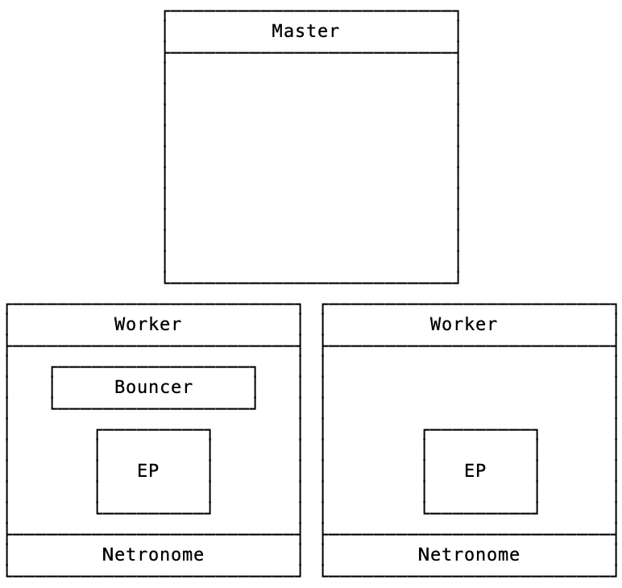
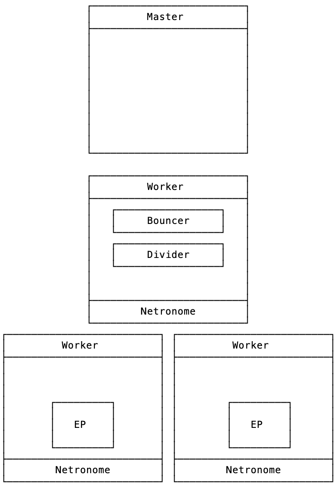

## XDP Offload Performance and Comparisons

#### Current Progress

- Aquired Hardware
- Installed Hardware
- Configure Hardware (In progress)
- Investigate Comparable Technologies (In progress)

#### Test Setup: Same Network

We will test and 3 baremetal machines.
Two of these machines each will be equipped with Netronome 10G CX network cards.
Bare metal machine specficiations:
Machine 1 (Master):
CPU:
RAM:
DISK:
NIC:

Machine 2 (Worker):
CPU:
RAM:
DISK:
NIC:

Machine 3 (Worker):
CPU:
RAM:
DISK:
NIC:

#### Test Setup: Cross Network

We will test and 4 baremetal machines.
Two of these machines each will be equipped with Netronome 10G CX network cards.
Bare metal machine specficiations:
Machine 1 (Master):
CPU:
RAM:
DISK:
NIC:

Machine 2 (Worker):
CPU:
RAM:
DISK:
NIC:

Machine 3 (Worker):
CPU:
RAM:
DISK:
NIC:

Machine 4 (Worker):
CPU:
RAM:
DISK:
NIC:

Mizar Specficiations to test:
- XDP SKB
- XDP DRIVER
- XDP OFFLOAD
- Compile Mizar in Benchmark Mode

### Additional Scenarios

### Network Policy, Packet Filter

### Loadbalancer, ClusterIP, Scaled Endpoint

#### Measurement Metrics

TCP Throughput
UDP PPS
Memory Usage
CPU Usage
Latency

### Comparable Technologies

#### Cilium
https://github.com/cilium/cilium
#### DPDK based Network Plugins

Intel has Userspace CNI
https://github.com/intel/userspace-cni-network-plugin#summary

##### Plugins for Userspace CNI
###### OVS-DPDK
https://github.com/openvswitch/ovs/blob/master/Documentation/intro/install/dpdk.rst

###### VPP
https://github.com/intel/userspace-cni-network-plugin#installing-vpp

Vector Packet Processing: Process multiple packets at the same time

Uses DPDK device driver and libraries for layer 1 functions (Option plugin for VPP)

### Results
